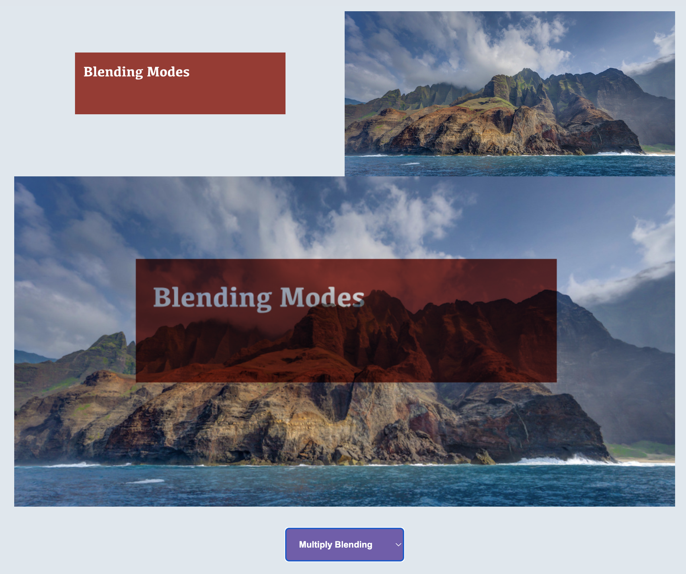

<h1 align='center'>Blending Modes</h1>

Javascript implementation of common blending modes.

Alpha Blending

$$c=\alpha_f c_f + (1 - \alpha_f) \alpha_b c_b$$

Multiply Blending

$$c=\alpha_f(c_f \cdot c_f) + (1 - \alpha_f) c_b$$

Additive Blending

$$\alpha= Clamp(\alpha_f + \alpha_b)$$

$$c=\frac{\alpha_f c_f(1 - \alpha_f) \alpha_b c_b} {\alpha}$$

Screen Blending

$$c=1-(1-c_f) (1-c_b)$$

Difference Blending

$$c=|\alpha_f c_f - c_b|$$